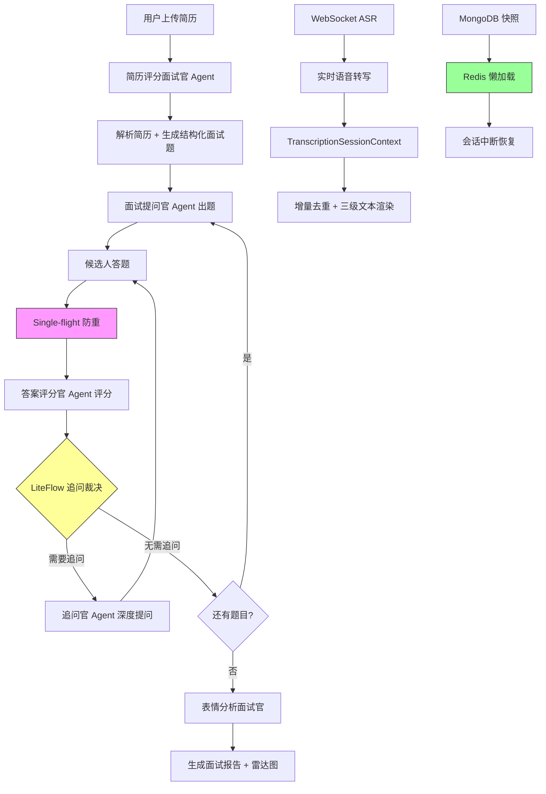

<div align="center">
  <h1>🎙️ InterviewHub — AI 智能面试平台</h1>

  <p align="center">
    <strong>LiteFlow 流程编排 · 多 Agent 协同评估 · 分布式 Single-flight · 长会话状态治理 · 实时 ASR 转写 · RAG 知识增强</strong>
  </p>

  <p align="center">
    
    
    
    
    
    
    
    
  </p>
</div>

<br/>

## 📖 项目简介

一个完整的 AI 智能面试后端系统，包含**AI 对话、智能体管理、模拟面试、实时语音转写、长文本语音合成**五大核心模块。实现了简历上传 → 智能解析出题 → 多 Agent 协同面试 → 追问裁决 → 神态分析 → 报告生成的**完整面试闭环**。

系统围绕**高可用、成本控制、状态一致性**三个核心目标设计：通过 LiteFlow 编排面试流程节点，结合 EnumMap 状态机驱动阶段流转；基于 Mongo Snapshot + Redis 懒加载实现长会话中断恢复；通过分布式 Single-flight 框架合并重复 AI 调用，降低 token 成本；以 WebSocket + 讯飞 AST 实现毫秒级实时语音转写，构建了**多 Agent 协同 + 状态可恢复 + 调用可去重**的高可靠面试服务体系。

<br/>

## 🔥 核心亮点

### 1. AI 面试链路编排：LiteFlow 流程引擎 + EnumMap 状态机

**问题**：面试流程涉及出题、提问、评分、追问、神态分析等多个环节，传统"面条代码"将流程逻辑硬编码在 Service 层，节点顺序耦合严重。新增一个面试环节（如追问裁决）需要修改多处代码，且不同 Agent 之间的数据传递依赖隐式的 ThreadLocal 或 Map 传参，维护性和可测试性极差。

**方案**：基于 LiteFlow 规则引擎构建面试流程编排层，将面试过程拆解为独立可配置的 Node 组件，结合 EnumMap 状态机控制面试阶段的流转：

- **节点抽象**：将出题（ExtractionNode）、提问（QuestionNode）、评分（ScoreNode）、追问（FollowUpNode）、神态分析（DemeanorNode）等面试环节抽象为 LiteFlow 组件，每个组件职责单一、可独立测试；
- **规则链配置**：通过 YAML 声明式配置面试流程规则链（`面试题出题官.yml`、`面试提问官.yml`、`用户答案评分官.yml` 等），节点编排顺序可热调整，无需改代码；
- **EnumMap 状态机**：设计 `InterviewSessionStatus` 枚举 + `EnumMap<Status, Handler>` 状态路由表，驱动 ANSWERING → SCORING → FOLLOW_UP → NEXT_QUESTION → FINISHED 的状态流转，新增状态只需添加枚举项和对应 Handler，符合开闭原则；
- **上下文传递**：通过 LiteFlow 的 `RequestContext` 在节点间显式传递面试上下文（问题列表、当前题号、历史评分），消除隐式传参。

```
出题 → 提问 → 答题 → 评分 → 追问裁决 → 下一题 / 完成
           ↑                            ↓
           └────────── 状态机驱动 ────────┘
```

### 2. 长会话状态治理：MongoDB 快照 + Redis 懒加载热恢复

**问题**：AI 面试通常持续 30-60 分钟，面试中途如果 Redis 发生故障或会话过期，面试运行态（当前题目、已答记录、追问状态、评分历史）全部丢失，候选人需要重新开始面试，体验极差且数据不一致。

**方案**：构建基于 MongoDB 热冷分层快照 + Redis 懒加载的可恢复运行态体系：

- **冷热分层**：Redis 作为热层，存储当前活跃面试的运行时状态（`InterviewRuntime`），提供毫秒级读写；MongoDB 作为冷层，存储完整的结构化快照（`InterviewSnapshot`），作为持久化兜底；
- **懒加载恢复**：`InterviewSessionRuntimeRehydrateService` 在面试会话恢复时，先从 Redis 读取热数据；若 Redis 缓存未命中，自动从 MongoDB 冷层查询最新快照并反序列化为运行态对象，重新注入 Redis，实现透明恢复；
- **CAS 并发保护**：快照更新采用 `version` 字段的 CAS（Compare-And-Swap）机制，防止多实例部署下并发写入导致的状态覆盖；
- **异步补偿**：`InterviewSessionRuntimeHotRefreshTrigger` 通过 Redis Stream 监听快照变更事件，异步刷新热缓存，保证热冷数据最终一致。

```
面试运行态 ──write──▶ Redis（热层，毫秒级）──async──▶ MongoDB（冷层，持久化）
    ▲                                                    │
    └──────────── 懒加载恢复（cache miss）◀───────────────┘
```

### 3. AI 调用去重控制：分布式 Single-flight 框架

**问题**：多实例部署场景下，同一道面试题的评分请求可能被多个实例同时处理，导致对 AI 模型的重复调用，造成 token 浪费和成本翻倍。极端情况下，用户在答题后点击"提交"按钮多次，或前端重试机制触发，都会产生冗余 AI 调用。

**方案**：设计并实现分布式 Single-flight 调用框架，核心机制包括：

- **请求合并**：通过 Redis Lua 脚本原子性地注册请求 key（`flight:{scene}:{bizId}`），首个到达的请求成为 Leader 并实际调用 AI，后续相同 key 的请求成为 Follower 并进入等待状态；
- **跨节点去重**：基于 Redis 的全局可见性，跨 JVM 实例共享请求注册表。Follower 通过 Redis Pub/Sub 或轮询监听结果就绪状态；
- **状态机驱动**：`FlightCoordinator` 维护 INIT → LEADER_RUNNING → RESULT_READY → TIMEOUT 的状态流转，配合 Fencing Token 防止脑裂场景下的旧 Leader 覆盖新结果；
- **结果回放**：Leader 完成后将结果写入 Redis（带 TTL），Follower 直接读取结果，无需重复调用 AI；
- **超时接管**：若 Leader 在 TTL 内未完成（如实例宕机），Follower 通过心跳检测发现超时后自动竞选为新 Leader，接管调用；
- **失败分类**：区分 AI 调用失败（可重试）和业务逻辑失败（不可重试），前者触发接管，后者直接返回错误给所有等待者。

```
请求到达 → Redis Lua 注册 → 首个 → Leader 调用 AI ──▶ 结果写入 Redis
                │                                        │
                └── 后续 → Follower 等待 ─────────────────┘ 结果回放
                              │
                              └── Leader 超时 → 竞选新 Leader → 接管调用
```

### 4. 实时 ASR 链路优化：会话级上下文管理 + 增量去重

**问题**：基于 WebSocket 的实时语音转写场景中，讯飞 AST 接口以流式片段（segment）返回识别结果，每个片段携带 `seg_id`、`pgs`（段落）、`rg`（区域）、`bg`（起始）、`ed`（结束）等定位信息。由于网络延迟波动和讯飞服务端重推机制，片段可能乱序到达或重复推送，导致前端展示的文本出现重复内容和前后缀抖动（同一句话在两次推送中显示不同文本）。

**方案**：设计会话级 `TranscriptionSessionContext`，借鉴 NIO Buffer 的异步缓冲思想，实现音频接收与下游推流的解耦：

- **会话级上下文**：每个 WebSocket 连接对应一个 `TranscriptionSessionContext` 实例，独立管理该会话的音频缓冲队列、识别中间态和已确认文本；
- **TreeMap 有序重建**：利用 TreeMap 按 `seg_id` 自然排序的特性，将乱序到达的识别片段有序插入，`committedText`（已确认文本）按序拼接，`liveText`（实时文本）显示当前未确认片段，`displayText`（最终展示文本）合并两者；
- **增量去重**：基于 `seg_id` + `pgs` 的重叠比对算法，新片段到达时与 TreeMap 中已存在的相邻片段做边界比对（`bg`/`ed` 重叠检查），若完全被覆盖则丢弃，若部分重叠则裁剪后合并，消除重复文本；
- **结果抖动解决**：对处于边界位置的片段（`rg=0` 表示句首），只有当后续片段到达并确认边界连续后，才将前一片段从 `liveText` 晋升为 `committedText`，避免"刚显示又被修正"的抖动体验。

```
WebSocket 音频帧 → 缓冲队列 → 讯飞 AST → 分段结果 → TreeMap 有序插入
                                                          │
                                          ┌───────────────┴───────────────┐
                                          │  seg_id 排序  │  pgs 重叠比对  │
                                          └───────────────┴───────────────┘
                                                          │
                                          committedText + liveText = displayText
```

### 5. RAG 知识增强体系：Skill 模块化知识单元

**问题**：面试 AI 的输出质量高度依赖 Prompt 中注入的领域知识（岗位能力模型、评分维度、追问策略）。传统做法将这些知识散落在文档、配置文件或 Prompt 模板中，面临三个痛点：知识更新需要改代码发版、不同 Agent 之间的知识无法复用、新人接手时面对分散的文档难以建立全局认知。

**方案**：构建面向 Agent 的 RAG 知识增强体系，将领域知识沉淀为模块化 Skill：

- **知识单元化**：将岗位能力模型（如 Java 工程师的技能维度权重）、评分规则（代码质量 / 系统设计 / 沟通表达 / 学习能力的评分锚点）、追问策略（STAR 追问模板）封装为独立的 Skill 模块；
- **Agent 可消费**：每个 Skill 包含结构化的 Markdown 知识文档（`references/`）、Agent 消费指令（`agents/`）和自动化脚本（`scripts/`），Claude Code 等 AI Coding 工具可直接读取 Skill 内容并注入到 Prompt 中；
- **业务一致性**：通过统一的 Skill 模板约束 AI 输出的评分口径和追问方向，避免不同 Agent 或不同会话中 AI "自由发挥"导致评估标准不一致；
- **持续演进**：Skill 以独立文件管理，更新某个评分维度只需修改对应 Skill 文件，无需改动业务代码，支持知识体系随业务迭代持续演进。

```
岗位能力模型  ─┐
评分规则      ─┼──▶ Skill 模块 ──▶ Agent Prompt 注入 ──▶ AI 输出
追问策略      ─┘        │
                        └── 版本化管理 · 独立更新 · 跨 Agent 复用
```

<br/>

## 📐 系统架构



<br/>

## 🛠 技术栈

| 层次 | 技术 | 说明 |
| :--- | :--- | :--- |
| 后端框架 | Spring Boot 3.4.4 · Java 17 | 主框架 |
| AI 集成 | Spring AI 1.0 · DeepSeek · 星火 | 多模型统一接入，OpenAI 兼容协议 |
| 持久层 | MySQL 8.0 · MyBatis-Plus 3.5.9 | 业务数据存储 + 乐观锁 |
| 文档数据库 | MongoDB 6.x | 运行态快照、对话消息持久化 |
| 缓存 / 分布式锁 | Redis · Redisson 3.27.2 | 会话状态缓存 + 分布式锁 + Lua 脚本 |
| 流程编排 | LiteFlow 2.15.3 | 面试流程规则链编排 |
| 认证鉴权 | Sa-Token 1.39.0 | 登录 / 权限 / WebSocket 鉴权 |
| 熔断限流 | Resilience4j 2.2.0 | 熔断、限流、重试、舱壁隔离 |
| 语音服务 | 讯飞 WebSDK 3.0.2 | 实时语音转写（ASR）+ 长文本合成（TTS） |
| 实时通信 | WebSocket（JSR 356）· SSE | 语音流双向通信 + AI 流式响应 |
| 容器化 | Docker Compose | 一键部署 MySQL + MongoDB + Redis |
| CI/CD | GitHub Actions | 自动构建与单元测试 |

<br/>

## 🚀 快速开始

### 环境要求

| 组件 | 版本 | 说明 |
| :--- | :--- | :--- |
| JDK | 17+ | 开发语言 |
| Maven | 3.6.3+ | 构建工具 |
| Docker | 20.10+ | 容器化运行中间件 |

### 本地运行

```bash
# 1. 克隆仓库
git clone https://github.com/CNIronBro/InterviewHub.git
cd InterviewHub

# 2. 启动中间件（MySQL + MongoDB + Redis）
docker-compose up -d

# 3. 编译运行
mvn clean package -DskipTests
java -jar admin/target/admin-*.jar
```

访问地址：`http://localhost:8080`

<br/>
