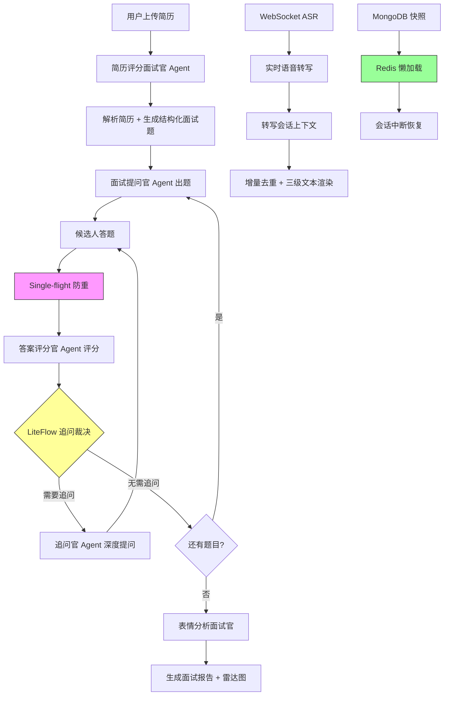

<div align="center">
  <h1>🎙️ InterviewHub — AI 智能面试平台</h1>

  <p align="center">
    <strong>讯飞星辰工作流编排 · LiteFlow 追问裁决 · 分布式 Single-flight · 长会话状态治理 · 实时 ASR 转写 · RAG 知识增强</strong>
  </p>

  <p align="center">
    
    
    
    
    
    
    
    
  </p>
</div>

<br/>

## 📖 项目简介

一个完整的 AI 智能面试后端系统，包含**AI 对话、智能体管理、模拟面试、实时语音转写、长文本语音合成**五大核心模块。实现了简历上传 → 智能解析出题 → 多 Agent 协同面试 → 追问裁决 → 神态分析 → 报告生成的**完整面试闭环**。

系统围绕**高可用、成本控制、状态一致性**三个核心目标设计：通过讯飞星辰工作流平台编排出题/提问/评分/神态分析等面试 Agent，结合 LiteFlow 规则引擎驱动追问裁决 + EnumMap 状态机控制阶段流转；基于 Mongo Snapshot + Redis 懒加载实现长会话中断恢复；通过分布式 Single-flight 框架合并重复 AI 调用，降低 token 成本；以 WebSocket + 讯飞 AST 实现毫秒级实时语音转写，构建了**多 Agent 协同 + 状态可恢复 + 调用可去重**的高可靠面试服务体系。

<br/>

## 🔥 核心亮点

### 1. AI 面试链路编排：讯飞星辰工作流 + LiteFlow 追问裁决 + EnumMap 状态机

**问题**：面试流程涉及出题、提问、评分、追问、神态分析等多个环节，传统"面条代码"将流程逻辑硬编码在 Service 层，节点顺序耦合严重。新增一个面试环节（如追问裁决）需要修改多处代码，且不同 Agent 之间的数据传递依赖隐式的 ThreadLocal 或 Map 传参，维护性和可测试性极差。

**方案**：采用「讯飞星辰工作流平台 + LiteFlow 追问裁决 + EnumMap 状态机」三层编排架构，各司其职：

- **讯飞星辰工作流**：出题（面试题出题官）、提问（面试提问官）、评分（用户答案评分官）、神态分析（表情分析面试官）等面试 Agent 通过讯飞星辰工作流平台进行可视化编排，支持 LLM 节点、知识库节点、决策节点、代码节点的拖拽式组合与热更新；
- **LiteFlow 追问裁决**：评分完成后，追问环节通过 LiteFlow 规则引擎驱动裁决链，串联 上下文加载 → 完成状态守卫 → 追问次数限制 → 当前追问守卫 → 核心锚点分析 → 实质证据守卫 → 高质量回答守卫 → 缺口判断 → 最终裁决。只有核心锚点存在可深挖证据时才允许追问，每个节点职责单一、可独立测试；
- **EnumMap 状态机**：设计会话状态枚举 + 状态→处理器路由表，驱动 答题中 → 评分中 → 追问中 → 下一题 → 已完成 的状态流转，新增状态只需添加枚举项和对应处理器，符合开闭原则；
- **上下文传递**：通过 LiteFlow 的请求上下文对象在追问裁决节点间显式传递决策信息（当前题号、历史评分、追问次数），消除隐式传参。

```
出题 → 提问 → 答题 → 评分 → 追问裁决 → 下一题 / 完成
  ↑                            ↑
  └── 讯飞星辰工作流编排 ──────┘── LiteFlow 规则链 ──┘
                    (状态机驱动流转)
```

### 2. AI 评分一致性治理：QuestionSpec 评分契约 + 锚点证据 + LiteFlow 确定性裁决

**问题**：如果让大模型同时决定评分标准、最终分数、是否复核和是否追问，同一道题、同一份答案也可能因为模型采样和语义判断波动得到不同结果。题目只有题面字符串时，出题、评分和追问之间缺少统一标准；系统只保存最终分数，也无法判断差异来自模型理解、评分规则还是流程异常。

**方案**：重新划分概率模型与确定性系统的职责边界——大模型负责理解非结构化语义并提取证据，后端负责计算分数、识别风险和推进流程：

- **QuestionSpec 评分契约**：题目生成时同步固化题面、评分锚点、权重、可接受表述、常见错误、追问策略和 `rubricVersion`。出题、评分、复核和追问共享同一套题目级标准，历史题目继续绑定创建时的评分协议；
- **锚点证据判断**：评分 Agent 不直接掌握最终裁决权，只判断 `correctness`、`completeness`、`logic`、`depth`、`clarity` 五个锚点的 `met / partial / missing / contradicted` 状态，并返回对应证据和置信度；
- **确定性规则算分**：LiteFlow 校验锚点完整性后，按照 30/25/20/15/10 的固定权重和状态系数聚合权威分数；若核心正确性锚点为 `contradicted`，分数最高封顶 40。相同锚点状态无论重试多少次，规则分都保持一致；
- **风险样本条件复核**：规则分命中 40/60/85 边界值或最低锚点置信度低于 0.7 时，才进入独立复核阶段；核心正确性锚点发生矛盾则直接采用保守结果。复核结论通过规则重新聚合或保守合并，不对两个概率分数简单求平均；复核失败则回退到首次合法规则分，不阻断主面试；
- **裁决与生成解耦**：LiteFlow 根据核心锚点和实际回答证据决定是否追问及追问目标，提问 Agent 只负责组织一条题内追问题面；服务端语义守卫拦截协议泄漏和无意义反馈，最终保存锚点证据、规则版本、原因码与复核记录，形成可回放的评分证据链。

```
QuestionSpec（题面 + 锚点 + 权重 + rubricVersion）
                       │
用户答案 ──▶ 评分 Agent 提取锚点证据 ──▶ 语义守卫
                       │
                       ▼
              LiteFlow 确定性算分
                       │
          ┌────────────┴────────────┐
          │                         │
      正常样本直接采用          风险样本条件复核
          │                         │
          └────────────┬────────────┘
                       ▼
              追问裁决 / 流程推进
```

### 3. 长会话状态治理：MongoDB 快照 + Redis 懒加载热恢复

**问题**：AI 面试通常持续 30-60 分钟，面试中途如果 Redis 发生故障或会话过期，面试运行态（当前题目、已答记录、追问状态、评分历史）全部丢失，候选人需要重新开始面试，体验极差且数据不一致。

**方案**：构建基于 MongoDB 热冷分层快照 + Redis 懒加载的可恢复运行态体系：

- **冷热分层**：Redis 作为热层，存储当前活跃面试的运行时状态，提供毫秒级读写；MongoDB 作为冷层，存储完整的结构化快照，作为持久化兜底；
- **懒加载恢复**：会话恢复时，先从 Redis 读取热数据；若缓存未命中，自动从 MongoDB 冷层查询最新快照并反序列化为运行态对象，重新注入 Redis，实现透明恢复；
- **CAS 并发保护**：快照更新采用版本号字段的 CAS（Compare-And-Swap）机制，防止多实例部署下并发写入导致的状态覆盖；
- **合并去抖**：为每个会话维护一个刷新聚合桶，短时间内多次快照更新请求合并为一次批量刷盘。普通中间态写入采用防抖策略（新请求到达重新计时，最多延迟不超过上限），避免频繁 I/O；关键检查点（如答题提交、会话结束）触发强制立即刷新，跳过防抖直接落盘，保证数据不丢失。

```
面试运行态 ──write──▶ Redis（热层，毫秒级）──async──▶ MongoDB（冷层，持久化）
    ▲                                                    │
    └──────────── 懒加载恢复（cache miss）◀───────────────┘
```

### 4. AI 调用去重控制：分布式 Single-flight 框架

**问题**：用户在答题后可能因等待焦虑或网络延迟连续点击"提交"按钮多次，加上前端重试、页面刷新等行为，同一道题的评分请求被重复发送，导致 AI 模型被多次调用，token 成本翻倍、评分结果不一致。

**方案**：设计并实现分布式 Single-flight 调用框架，核心机制包括：

- **请求合并**：通过 Redis Lua 脚本原子性地注册请求 key（`flight:{scene}:{bizId}`），首个到达的请求成为 Owner 并实际调用 AI，后续相同 key 的请求成为 Follower 并进入等待状态；
- **跨节点去重**：基于 Redis 的全局可见性，跨 JVM 实例共享请求注册表。Follower 通过 Redis Stream 阻塞等待 Owner 完成通知，同时辅以轮询兜底防止消息丢失；
- **状态机驱动**：去重协调器维护 初始化 → 执行中 → 结果就绪 → 超时 的状态流转，配合 Fencing Token 防止脑裂场景下的旧 Owner 覆盖新结果；
- **结果回放**：Owner 完成后将结果写入 Redis（带 TTL），Follower 直接读取结果，无需重复调用 AI；
- **超时接管**：若 Owner 在 TTL 内未完成（如实例宕机），Follower 通过心跳检测发现超时后自动竞选为新 Owner，接管调用；
- **失败分类**：区分 AI 调用失败（可重试）和业务逻辑失败（不可重试），前者触发接管，后者直接返回错误给所有等待者。

```
请求到达 → Redis Lua 注册 → 首个 → Owner 调用 AI ──▶ 结果写入 Redis
                │                                        │
                └── 后续 → Follower 等待 ─────────────────┘ 结果回放
                              │
                              └── Owner 超时 → 竞选新 Owner → 接管调用
```

### 5. 实时 ASR 链路优化：会话级上下文管理 + 增量去重

**问题**：基于 WebSocket 的实时语音转写场景中，讯飞 AST 接口以流式片段返回识别结果，每个片段携带片段序号、段落位置、区域标识、起止偏移等定位信息。由于网络延迟波动和讯飞服务端重推机制，片段可能乱序到达或重复推送，导致前端展示的文本出现重复内容和前后缀抖动（同一句话在两次推送中显示不同文本）。

**方案**：设计会话级转写上下文，借鉴 NIO Buffer 的异步缓冲思想，实现音频接收与下游推流的解耦：

- **会话级上下文**：每个 WebSocket 连接对应一个独立的转写上下文实例，管理该会话的音频缓冲队列、识别中间态和已确认文本；
- **有序重建**：利用有序映射按片段序号自然排序的特性，将乱序到达的识别片段有序插入，已确认文本按序拼接，实时文本显示当前未确认片段，最终展示文本合并两者；
- **增量去重**：基于片段序号 + 段落位置的重叠比对算法，新片段到达时与已存在的相邻片段做边界比对（起止位置重叠检查），若完全被覆盖则丢弃，若部分重叠则裁剪后合并，消除重复文本；
- **结果抖动解决**：对处于边界位置的片段（如句首），只有当后续片段到达并确认边界连续后，才将前一片段从实时文本晋升为已确认文本，避免"刚显示又被修正"的抖动体验。

```
WebSocket 音频帧 → 缓冲队列 → 讯飞 AST → 分段结果 → 有序映射排序
                                                          │
                                          ┌───────────────┴───────────────┐
                                          │  片段序号排序  │  段落重叠比对  │
                                          └───────────────┴───────────────┘
                                                          │
                                          已确认文本 + 实时文本 = 最终展示文本
```

### 6. 知识腐化治理：面向 AI Coding 的 Skill 动态知识体系

**问题**：AI Coding 能力越来越强，但它无法理解项目中的隐性业务规则。比如让 AI 优化一个 PV 统计接口，它会"专业"地加上用户去重逻辑——但它永远不会知道，产品设计之初就是故意不去重的，因为重复浏览意味着更强的购买意愿。这些知识只存在于开发者的脑子里，人离职了，知识就丢了，下一个人和他的 AI 都要重新踩一遍坑。

更糟糕的是，很多团队试图用文档解决这个问题，但文档本身会腐化——写了没人更新，更新了没人 Review，最终变成一堆过时的废话。

**方案**：为项目中的每个核心模块维护一个 Skill 文件（AI 可消费的结构化知识单元），并建立四条自动化路径让知识随代码持续演进：

- **反向校验**：AI 在 Coding 时本就需要同时阅读 Skill 和实际代码，交叉比对两者是否一致是顺带完成的动作。发现 Skill 描述与代码现状不符时，自动生成修正建议，人工确认后更新；
- **沟通沉淀**：遇到 Skill 未覆盖的知识盲区时，开发者在 Coding 前与 AI 沟通补充业务背景。沟通结束后 AI 自动总结新增知识点并写入 Skill，让知识沉淀成为开发过程的自然副产品，而非"有空再补"的负担；
- **提交前检查**：代码 commit 前自动 diff 分析，判断变更是否命中知识更新规则。命中则生成结构化更新建议（精确到模块和流程），Review 通过后自动同步 Skill，做到"代码改了什么，知识就同步什么"；
- **基线巡检**：合并到 master 后执行全量健康扫描——校验代码锚点有效性、比对接口定义与实际路由、比对数据模型描述与最新表结构、统计知识覆盖度和新鲜度，生成健康报告供 Review。

```
待 AI Coding（读 Skill + 读代码）──▶ 交叉比对 ──▶ 发现不一致 ──▶ 修正建议 ──▶ 人确认
                                                                    │
人机沟通补充 ──▶ AI 自动总结 ──▶ 更新 Skill ◀── 人 Review ◀── 自动 Diff 分析 ◀── git commit
                                                                                    │
                                                                    master 合并 ──▶ 全量巡检
```

<br/>

## 📐 系统架构



<br/>

## 🛠 技术栈

| 层次 | 技术 | 说明 |
| :--- | :--- | :--- |
| 后端框架 | Spring Boot 3.4.4 · Java 17 | 主框架 |
| AI 集成 | Spring AI 1.0 · DeepSeek · 星火 | 多模型统一接入，OpenAI 兼容协议 |
| 持久层 | MySQL 8.0 · MyBatis-Plus 3.5.9 | 业务数据存储 + 乐观锁 |
| 文档数据库 | MongoDB 6.x | 运行态快照、对话消息持久化 |
| 缓存 / 分布式锁 | Redis · Redisson 3.27.2 | 会话状态缓存 + 分布式锁 + Lua 脚本 |
| 流程编排 | LiteFlow 2.15.3 | 追问裁决规则链编排 |
| 认证鉴权 | Sa-Token 1.39.0 | 登录 / 权限 / WebSocket 鉴权 |
| 熔断限流 | Resilience4j 2.2.0 | 熔断、限流、重试、舱壁隔离 |
| 语音服务 | 讯飞 WebSDK 3.0.2 | 实时语音转写（ASR）+ 长文本合成（TTS） |
| 实时通信 | WebSocket（JSR 356）· SSE | 语音流双向通信 + AI 流式响应 |
| 容器化 | Docker Compose | 一键部署 MySQL + MongoDB + Redis |
<br/>

## 🚀 快速开始

### 环境要求

| 组件 | 版本 | 说明 |
| :--- | :--- | :--- |
| JDK | 17+ | 开发语言 |
| Maven | 3.6.3+ | 构建工具 |
| Docker | 20.10+ | 容器化运行中间件 |

### 本地运行

```bash
# 1. 克隆仓库
git clone https://github.com/CNIronBro/InterviewHub.git
cd InterviewHub

# 2. 启动中间件（MySQL + MongoDB + Redis）
docker-compose up -d

# 3. 编译运行
mvn clean package -DskipTests
java -jar admin/target/admin-*.jar
```

访问地址：`http://localhost:8080`

<br/>
